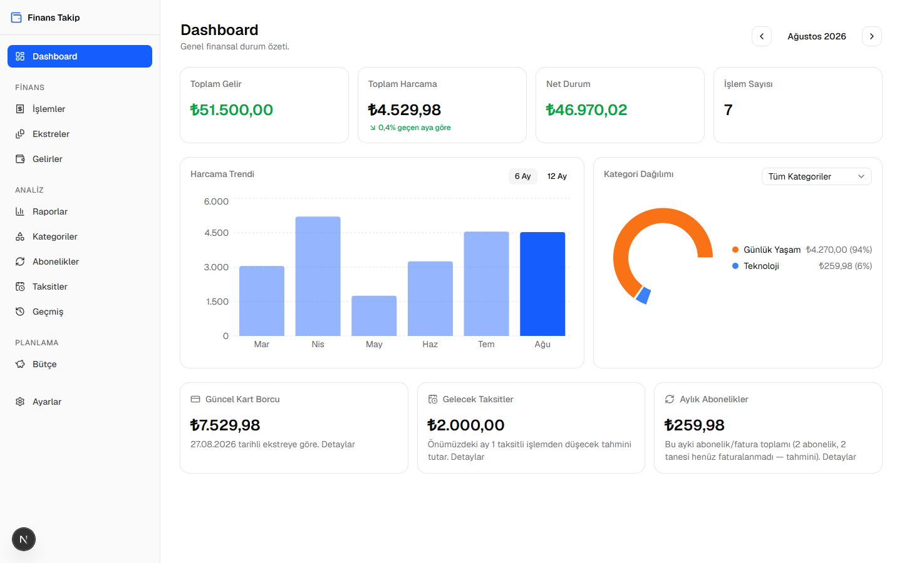
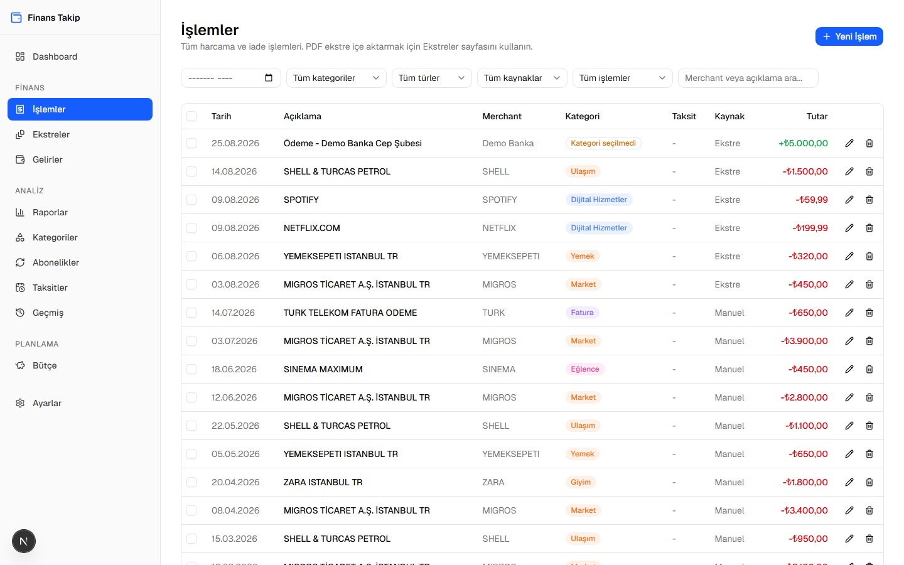
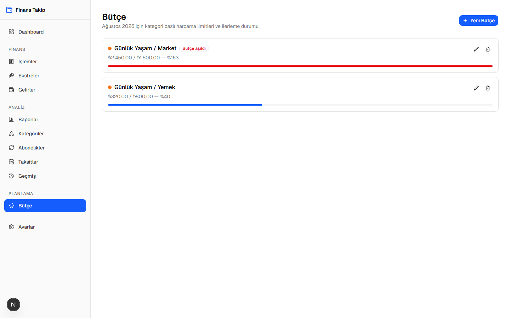
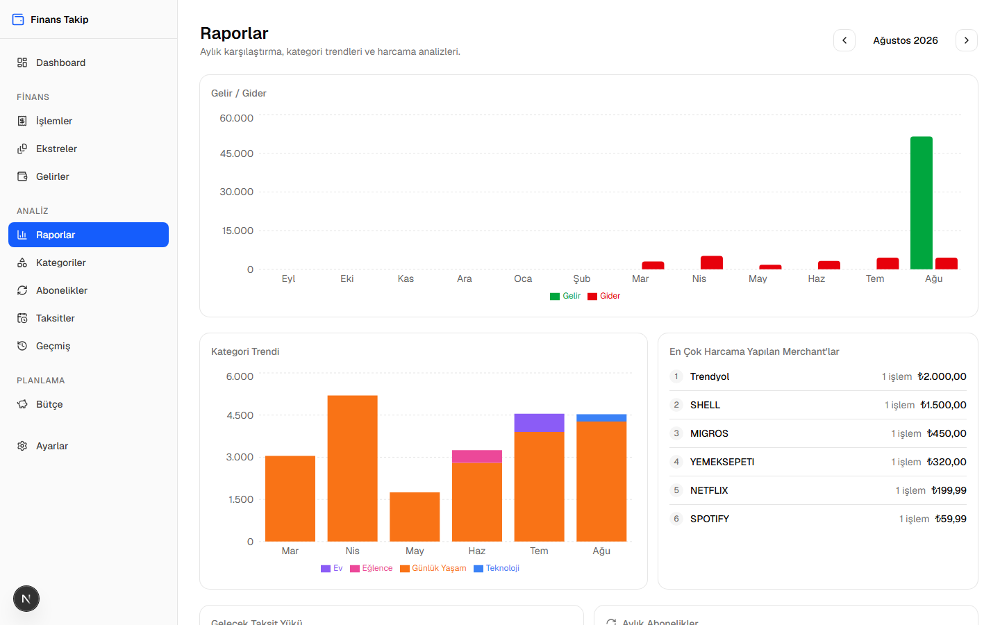
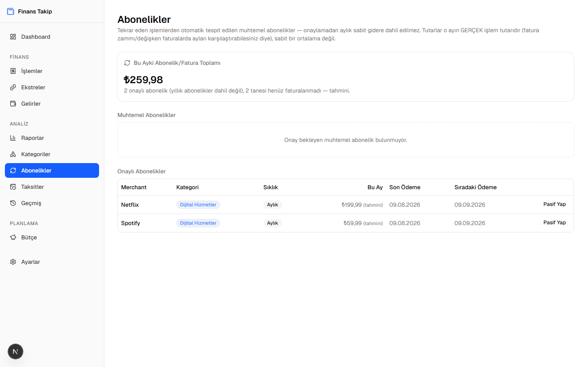
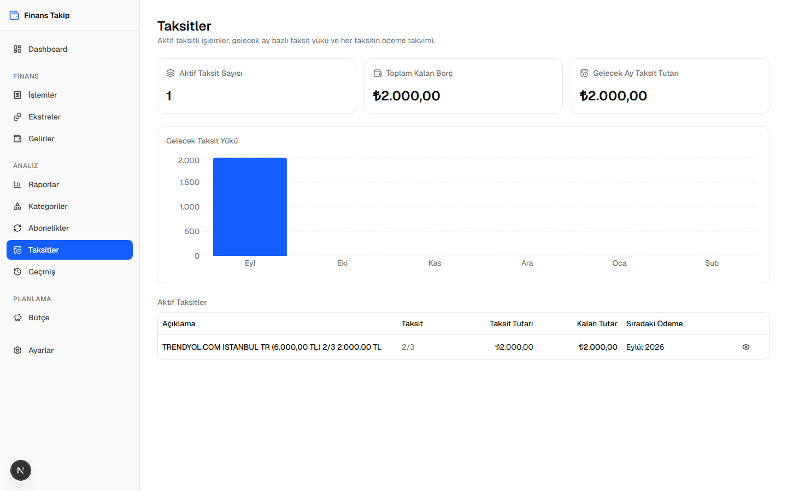

# Kişisel Finans Takip Uygulaması

[](./LICENSE)


> **A local-only, single-user personal finance tracker for Enpara bank customers (Turkey).** Upload a credit-card or checking-account statement PDF, it parses and auto-categorizes every transaction, then gives you a dashboard, budgets, subscription detection, and installment tracking — all on `localhost`, no cloud, no account, your data never leaves your machine.

Lokal (yalnızca `localhost` üzerinde) çalışan, tek kullanıcılı kişisel finans ve harcama takip uygulaması. Enpara kredi kartı ve hesap özeti PDF'lerini içe aktarır, işlemleri otomatik kategorize eder, taksit ve abonelik takibi yapar, bütçe limitleri koyar ve aylık finansal durumu dashboard/raporlar üzerinde gösterir. Kimlik doğrulama yok, çoklu kullanıcı yok, bulut yok — tüm veri yerel bir SQLite dosyasında.

## Ekran Görüntüleri

| Dashboard | İşlemler |
|---|---|
|  |  |

| Bütçe | Raporlar |
|---|---|
|  |  |

| Abonelikler | Taksitler |
|---|---|
|  |  |

*(Görüntülerdeki tüm veriler kurgusaldır — demo amaçlı üretilmiştir, gerçek bir hesaba ait değildir.)*

## Öne Çıkan Özellikler

- **PDF ekstre içe aktarma** — Enpara kredi kartı ve hesap özeti (çekme hesabı) PDF'lerini ayrıştırır; sayfa başlıkları, mutabakat formülü ve çok satırlı işlem kayıtları dahil gerçek dünya formatlarına göre yazılmıştır.
- **Otomatik kategorizasyon** — öncelik zinciri: manuel seçim > merchant kuralı > bilinen merchant > anahtar kelime deseni. Bir işlemin kategorisini bir kez düzeltip "Gelecekte de uygula" dediğinizde, aynı merchant'a ait geçmiş işlemler de toplu güncellenir.
- **Taksit takibi** — orijinal satın alma tarihini koruyarak, gelecek taksitleri ayrı kayıt oluşturmadan projeksiyon olarak hesaplar.
- **Abonelik tespiti** — tekrar eden ödemelerden muhtemel abonelikleri otomatik önerir, onaylı/pasif ayrımı kullanıcıda kalır.
- **Bütçe & raporlar** — kategori bazlı aylık harcama limitleri, gelir/gider trendi, kategori dağılımı, en çok harcama yapılan merchant'lar.
- **Güncel kart borcu** — ekstrenin kendi mutabakat formülünden (önceki bakiye − ödemeler + harcamalar) türetilir, ayrı bir alan olarak saklanmaz.
- **Tamamen lokal** — SQLite dosya veritabanı, sunucu tarafı üçüncü parti servis yok; PDF'ler diskte hiç saklanmaz, sadece ayrıştırılıp veritabanına yazılır.

## Kaynaklar

- [`PROJECT_SPEC.md`](./PROJECT_SPEC.md) — 74 bölümlük orijinal ürün/teknik gereksinim dokümanı (iş kuralları, kategori öncelik sırası, taksit matematiği, abonelik tespiti sezgiselleri).
- [`docs/PHASES.md`](./docs/PHASES.md) — faz faz geliştirme günlüğü, her fazın kapsamı ve gerçek veriyle bulunan hatalar.
- [`docs/BACKLOG.md`](./docs/BACKLOG.md) — belirli bir faza bağlı olmayan denetim bulguları ve ürün fırsatları.

## Stack

Next.js 16 (App Router, Turbopack) · React 19 · TypeScript (strict) · Tailwind CSS v4 · shadcn/ui (Base UI) · Prisma 7 + SQLite (`better-sqlite3` driver adapter) · Recharts · zod 4 · date-fns · vitest · Playwright (uçtan uca doğrulama).

## Geliştirme Durumu

Faz 1–11 tamamlandı (kurulum → database → manuel işlemler → PDF parser → import preview → kategori hafızası → dashboard → taksit → abonelik → bütçe → raporlar). Faz 12 (AI destekli kategorizasyon) kullanıcı kararıyla kapsam dışı bırakıldı. Detaylı checklist için [`docs/PHASES.md`](./docs/PHASES.md).

## Kurulum

```bash
npm install
cp .env.example .env        # DATABASE_URL="file:./data/finance.db"
npm run db:migrate          # şemayı uygula
npm run db:seed             # varsayılan kategorileri yükle
npm run dev                 # http://localhost:3000
```

## Komutlar

```bash
npm run dev            # localhost:3000
npm run build           # production build
npm run typecheck       # tsc --noEmit
npm run lint
npm run test            # vitest run
npm run db:migrate      # prisma migrate dev
npm run db:seed         # varsayılan kategorileri yükle
npm run db:studio       # Prisma Studio
```

## Klasör Yapısı

```
app/            Next.js sayfaları (route başına bir klasör) + server actions
components/     UI bileşenleri (layout/, domain klasörleri + ui/ = shadcn primitives)
lib/            İş mantığı: db, pdf, bank-account, categorization, merchants,
                installments, subscriptions, analytics, budgets, money.ts, validation
prisma/         schema.prisma + seed.ts + migrations
data/           finance.db (SQLite, git'e dahil değil)
tests/          parser / categorization / installments / analytics / bank-account testleri
```

## Lisans

[MIT](./LICENSE)
